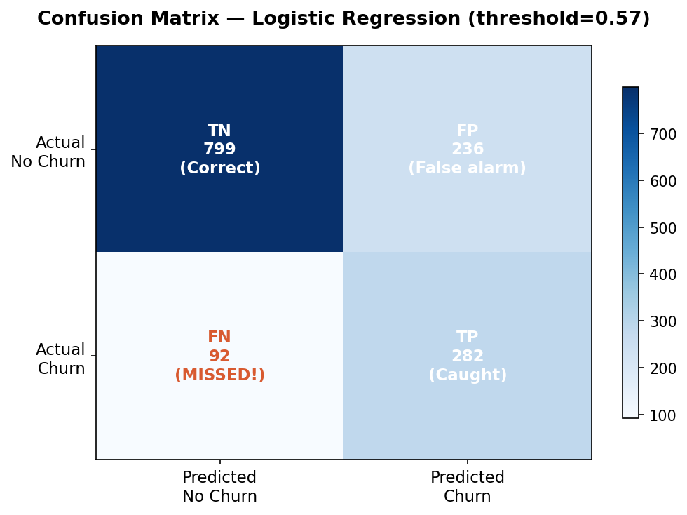

# Customer Churn Prediction

### Imbalanced Classification · SHAP Explainability · Business ROI

> Dự đoán khách hàng có khả năng rời bỏ dịch vụ Telco, giải thích tại sao bằng SHAP,
> và tính ROI của chương trình retention.

---

## Dataset

**Source**: [IBM Telco Customer Churn](https://www.kaggle.com/datasets/blastchar/telco-customer-churn)

| Property     | Value                              |
| ------------ | ---------------------------------- |
| Customers    | 7,043                              |
| Features     | 20                                 |
| Churn rate   | 26.5%                              |
| Problem type | Binary classification (imbalanced) |

Churn rate theo loại hợp đồng — khách **Month-to-month** rời bỏ nhiều nhất, gấp ~15 lần khách **Two year**:

| Contract       | Churn Rate | Customers |
| -------------- | ---------: | --------: |
| Month-to-month |      42.7% |     3,875 |
| One year       |      11.3% |     1,473 |
| Two year       |       2.8% |     1,695 |

---

## Results

| Model                   | Precision |    Recall |    F1 | AUC-ROC | PR-AUC |
| ----------------------- | --------: | --------: | ----: | ------: | -----: |
| **Logistic Regression** |     0.512 | **0.829** | 0.633 |   0.862 |  0.690 |
| Random Forest           |     0.577 |     0.698 | 0.632 |   0.854 |  0.661 |
| Gradient Boosting       |     0.680 |     0.540 | 0.602 |   0.854 |  0.673 |
| XGBoost                 |     0.520 |     0.794 | 0.629 |   0.852 |  0.671 |

**Model được chọn: Logistic Regression** (Recall cao nhất — ưu tiên bắt được càng nhiều khách sắp rời bỏ
càng tốt, chấp nhận đánh đổi precision thấp hơn, vì bỏ sót một khách rời bỏ tốn kém hơn nhiều so với một
lần gửi nhầm ưu đãi retention).

**Trên tập test**, threshold tối ưu tìm được là **0.59** (thay vì mặc định 0.50):

| Threshold       | Precision | Recall |    F1 | AUC-ROC |
| --------------- | --------: | -----: | ----: | ------: |
| 0.50 (mặc định) |     0.506 |  0.802 | 0.620 |   0.839 |
| 0.59 (tối ưu)   |     0.546 |  0.733 | 0.626 |   0.839 |

Threshold cao hơn giúp giảm số lượng false alarm (khách bị gắn nhầm là sắp rời bỏ), đổi lại nhận diện được
ít hơn một chút — đây chính là trade-off được thể hiện trong `images/threshold_analysis.png`.

### Business ROI (test set, threshold = 0.59)

| Item                                     | Count |       Amount |
| ---------------------------------------- | ----: | -----------: |
| Correctly caught churners (TP)           |   274 |     +$64,116 |
| False alarms (FP) — retention cost spent |   228 |     -$11,400 |
| Missed churners (FN) — revenue lost      |   100 |     -$78,000 |
| Total retention spend                    |   502 |     -$25,100 |
| Total revenue saved                      |     — |     +$64,116 |
| **Net benefit vs. no model**             |     — | **+$39,016** |
| Revenue lost with no model at all        |   374 |    -$291,720 |

_(Giả định: avg monthly revenue $65, avg tenure lost 12 tháng, retention cost $50/khách,_
_retention offer thành công 30% — chỉnh trong `compute_roi_table()` nếu bạn có số thực tế khác.)_

---

## Key Visualizations

### Class Imbalance


### Imbalanced Strategy Comparison


### ROC & PR Curves


### Threshold Optimization


### Confusion Matrix (test set, tuned threshold)



### Feature Importance


---

## Cấu trúc project

```
churn-prediction/
│
├── README.md
├── requirements.txt
│
├── notebooks/
│   ├── 00_EDA.ipynb
│   ├── 01_modeling.ipynb
│   ├── 02_shap.ipynb
│   └── 03_business_recommendation.ipynb
│
├── src/
│   ├── __init__.py
│   ├── data_loader.py
│   ├── preprocessing.py
│   ├── split_and_imbalance.py
│   ├── evaluate.py
│   └── shap_analysis.py
│
├── data/
│   ├── Telco-Customer-Churn.csv
│   ├── best_model.pkl
│   └── model_meta.json        # tên model + threshold tối ưu, sinh ra bởi 01_modeling
│
└── images/
```

---

## Cách chạy

```bash
git clone https://github.com/YOUR_USERNAME/churn-prediction
cd churn-prediction

# Setup (Windows)
python -m venv venv
venv\Scripts\activate
pip install -r requirements.txt

# Chạy theo thứ tự — mỗi notebook phụ thuộc output của notebook trước
jupyter notebook
# → 00_EDA → 01_modeling → 02_shap → 03_business_recommendation
```

## Tech Stack

`Python 3.11` · `scikit-learn` · `imbalanced-learn` · `shap` · `XGBoost` · `pandas` · `matplotlib` · `seaborn`
