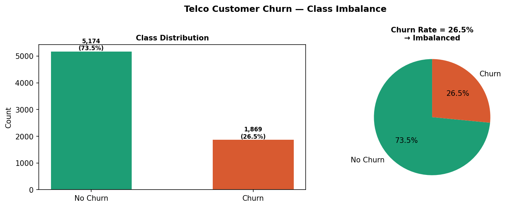
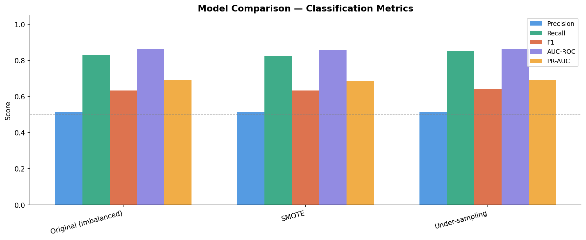
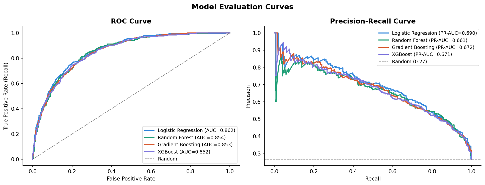
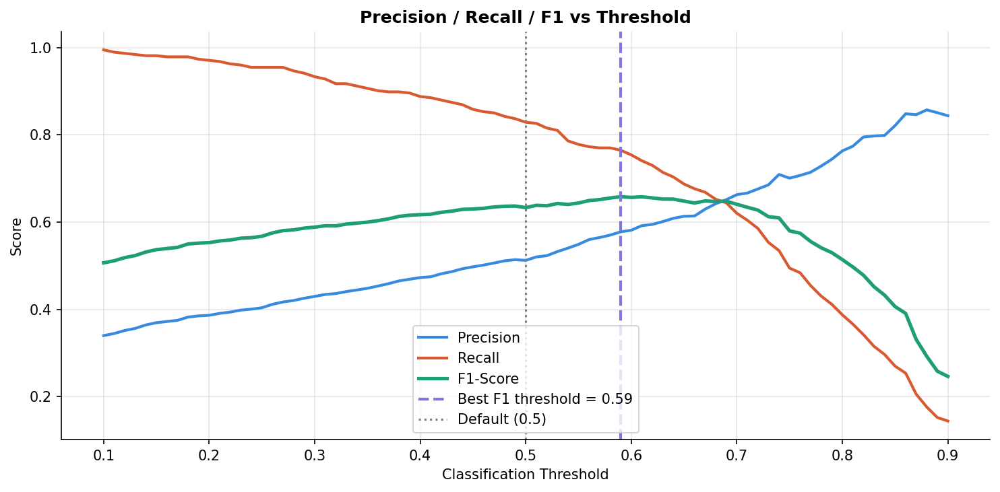
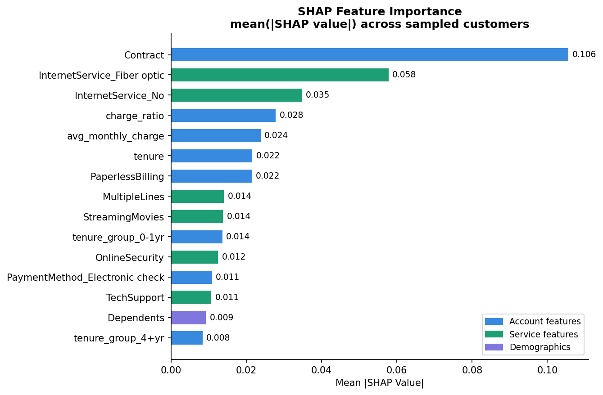

# Customer Churn Prediction

### Imbalanced Classification · SHAP Explainability · Business ROI

> Dự đoán khách hàng có khả năng rời bỏ dịch vụ Telco,
> giải thích tại sao bằng SHAP, và tính ROI của chương trình retention.

---

## Điểm nổi bật

- **Xử lý imbalanced data đúng cách** — so sánh SMOTE, class_weight, under-sampling
- **SHAP Explainability** — không chỉ predict mà còn giải thích được tại sao
- **ROI Calculator** — translate model output thành business value ($)
- **Threshold optimization** — không dùng 0.5 mặc định, tìm threshold tối ưu cho F1

---

## Dataset

**Source**: [IBM Telco Customer Churn](https://www.kaggle.com/datasets/blastchar/telco-customer-churn)

| Property     | Value                              |
| ------------ | ---------------------------------- |
| Customers    | 7,043                              |
| Features     | 20                                 |
| Churn rate   | ~26%                               |
| Problem type | Binary classification (imbalanced) |

---

## Results

| Model                          | Precision | Recall |    F1 | AUC-ROC | PR-AUC |
| ------------------------------ | --------: | -----: | ----: | ------: | ------ |
| Logistic Regression            |     0.506 |  0.797 | 0.619 |   0.848 | 0.671  |
| Random Forest                  |     0.558 |  0.709 | 0.624 |   0.841 | 0.646  |
| **Gradient Boosting** _(best)_ |     0.646 |  0.532 | 0.584 |   0.838 | 0.646  |
| XGBoost                        |     0.521 |  0.789 | 0.628 |   0.841 | 0.651  |

---

## Key Visualizations

### Class Imbalance



### Imbalanced Strategy Comparison



### ROC & PR Curves



### Threshold Optimization



### SHAP Feature Importance



## Cấu trúc project

```
churn-prediction/
│
├── README.md
├── requirements.txt
│
├── notebooks/
│   ├── 00_EDA.py/.ipynb
│   ├── 01_modeling.py/.ipynb
│   ├── 02_shap.py/.ipynb
│   └── 03_business_recommendation.py/.ipynb
│
├── src/
│   ├── data_loader.py
│   ├── preprocessor.py
│   ├── evaluate.py
│   └── shap_analysis.py
│
├── data/
│   ├── Telco-Customer-Churn.csv
│   ├── best_model.pkl
│   └── feature_columns.pkl
│
└── images/
```

---

## Cách chạy

```bash
git clone https://github.com/YOUR_USERNAME/churn-prediction
cd churn-prediction

# Setup (Windows)
python -m venv venv
venv\Scripts\activate
pip install -r requirements.txt

# Chạy theo thứ tự
jupyter notebook
# → 00_EDA → 01_modeling → 02_shap → 03_business_recommendation
```

## Tech Stack

`Python 3.11` · `scikit-learn` · `imbalanced-learn` · `shap` · `XGBoost` · `pandas` · `matplotlib` · `seaborn`
